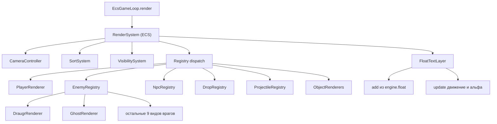

# Рефакторинг рендеринга VARDLOKKUR — один класс на объект (SOLID + ECS)

## 1. Проблема

Рендеринг сейчас «размазан» по нескольким файлам и основан на функциях с большими `switch/case`:

| Файл | Что содержит | Проблема |
|------|--------------|----------|
| `src/game/renderers/index.ts` (709 стр.) | Чистые функции отрисовки `renderPlayer`, `renderEnemy`, `renderNpc`, `renderDrop`, `renderProjectile`, `renderChest`, `renderPedestal`, `renderShrine`, `renderDoor`, `renderBarrier`, `renderAltar`. Внизу — классы-заглушки (`PlayerRenderer` и т.д.), которые лишь оборачивают функции | `renderEnemy` — `switch (e.kind)` на 11 видов врагов; `renderNpc` — `switch (data.id)`; `renderDrop` — `switch (data.kind)` на ~20 видов; `renderProjectile` — `switch (data.kind)`. Каждый новый вид = правка существующего switch (нарушение OCP) |
| `src/game/ecs/ecs-render-helpers.ts` | `draw*` функции-мосты: превращают поля ECS-компонентов в data-объекты (`IPlayerData`, `IEnemyData`…) и вызывают render-функции | Дублирование логики, позиционные параметры по 10–15 шт., ещё один «слой-простыня» |
| `src/game/ecs/ecs-systems/render-system.ts` (564 стр.) | Оркестратор `renderSystem()` + `addFloatText`/`updateFloatTexts` + утилиты `renderSprites`/`renderSortSystem`/`renderVisibilitySystem`/`renderFlashSystem` + циклы `render*` по каждому типу сущности | Всё в одном файле, каждый тип обрабатывается отдельной функцией с дублирующимися циклами по `query(...)` |
| `src/game/ecs/ecs-game-loop.ts` (`render()`) | Вызывает `renderSystem(...)` с 12+ позиционными аргументами | Хрупкая сигнатура |
| `src/game/store/game-store.ts` + `src/game/models.ts` | Собственный `FloatText` и `addFloatText`/`removeFloatText` | Дублирование модели плавающего текста с `render-system.ts` |

### Итоговая проблема одной фразой

> Есть функции отрисовки с кучей `case` и `updateFloatTexts`, разбросанные по нескольким файлам. Нужно, чтобы **один класс отвечал за отрисовку одного объекта**, а система-оркестратор (ECS) лишь диспетчеризовала к правильному классу.

---

## 2. Целевая архитектура

Применяем **SOLID**:

- **SRP** — один класс-рендерер на один вид объекта (тип врага, дропа, NPC, снаряда).
- **OCP** — добавление нового вида = создание нового класса + регистрация в реестре. Никаких правок в существующих `switch`.
- **LSP** — все рендереры реализуют единый интерфейс `Renderer<T>` и взаимозаменяемы.
- **ISP** — интерфейс рендерера зависит только от своего `data`-типа; общая геометрия вынесена в примитивы; общее поведение врагов — в абстрактный базовый класс.
- **DIP** — оркестратор (`RenderSystem`) зависит от интерфейса `Renderer<T>` и реестра, а не от конкретных классов.

Применяем **ECS**: `RenderSystem` остаётся ECS-системой — она делает `query(world, [SpriteComp, Enemy])`, читает компоненты, строит data-объект и диспетчеризует в реестр по «виду» (значению из StringPool).

### Схема



### Целевая структура директории `src/game/renderers/`

```
src/game/renderers/
├── index.ts                      # barrel-экспорт
├── core/
│   ├── types.ts                  # Renderer<T>, RenderContext
│   ├── registry.ts               # RendererRegistry (типизированный Map)
│   └── primitives.ts             # pixel-примитивы (rect/ellipse/stroke), helper P
├── player/
│   └── PlayerRenderer.ts
├── enemy/
│   ├── BaseEnemyRenderer.ts      # общий скелет: тень, bob, tint/flash, hp-бар
│   ├── DraugrRenderer.ts
│   ├── VargRenderer.ts
│   ├── RavenRenderer.ts
│   ├── ShroomRenderer.ts
│   ├── CrawlerRenderer.ts
│   ├── FrostRenderer.ts
│   ├── ReaperRenderer.ts
│   ├── SpiderRenderer.ts
│   ├── GiantRenderer.ts
│   ├── SnakeRenderer.ts
│   ├── GhostRenderer.ts
│   └── index.ts                  # enemyRegistry: регистрация всех видов
├── npc/
│   ├── NpcRenderer.ts            # базовый скелет NPC (mark, blink, shadow)
│   ├── EirikRenderer.ts
│   ├── AstridRenderer.ts
│   ├── HaraldRenderer.ts
│   ├── RavenNpcRenderer.ts
│   ├── DaughterRenderer.ts
│   ├── SoulRenderer.ts
│   └── index.ts                  # npcRegistry
├── drop/
│   ├── BaseDropRenderer.ts       # bob, taken-check
│   ├── HeartRenderer.ts / ArrowDropRenderer.ts / RuneRenderer.ts / ...
│   └── index.ts                  # dropRegistry
├── projectile/
│   ├── BaseProjectileRenderer.ts # rot-helper, quad-helper
│   ├── ArrowProjectileRenderer.ts / AxeProjectileRenderer.ts / SporeProjectileRenderer.ts / FireProjectileRenderer.ts
│   └── index.ts                  # projectileRegistry
├── objects/
│   ├── ChestRenderer.ts
│   ├── PedestalRenderer.ts
│   ├── ShrineRenderer.ts
│   ├── DoorRenderer.ts
│   ├── BarrierRenderer.ts
│   └── AltarRenderer.ts
└── float/
    ├── FloatTextLayer.ts         # класс: add / update / remove
    └── index.ts
```

`src/game/ecs/ecs-systems/render-system.ts` превращается в тонкий ECS-оркестратор. Файл `src/game/ecs/ecs-render-helpers.ts` удаляется (его `draw*` функции встраиваются как мапперы ECS→data прямо в `RenderSystem` или переносятся в `renderers/`-мапперы).

---

## 3. Порядок выполнения

### Шаг 1. Фундамент: `core/`

**Создать `src/game/renderers/core/types.ts`**

```ts
import type { Graphics } from "pixi.js";

/** Контекст, общий для всех рендереров */
export interface RenderContext {
  time: number;
  [key: string]: unknown;
}

/** Единый контракт рендерера: один класс = один объект */
export interface Renderer<TData> {
  render(g: Graphics, data: TData, ctx: RenderContext): void;
}
```

**Создать `src/game/renderers/core/registry.ts`**

```ts
import type { Renderer } from "./types";

/** Типизированный реестр рендереров по строковому ключу (вид сущности) */
export class RendererRegistry<TKey extends string, TData> {
  private readonly map = new Map<TKey, Renderer<TData>>();
  register(key: TKey, r: Renderer<TData>): this { this.map.set(key, r); return this; }
  get(key: TKey): Renderer<TData> | undefined { return this.map.get(key); }
  has(key: TKey): boolean { return this.map.has(key); }
  keys(): IterableIterator<TKey> { return this.map.keys(); }
}
```

**Создать `src/game/renderers/core/primitives.ts`** — вынести `P()` и общие хелперы из `renderers/index.ts` (сейчас `P` определена локально и недоступна вне файла):

```ts
import type { Graphics } from "pixi.js";

export function px(g: Graphics, x: number, y: number, w: number, h: number, c: number, a = 1): void {
  g.rect(x, y, w, h).fill({ color: c, alpha: a });
}
export function ell(g: Graphics, x: number, y: number, rw: number, rh: number, c: number, a = 1): void {
  g.ellipse(x, y, rw, rh).fill({ color: c, alpha: a });
}
export function stk(g: Graphics, ...args: Parameters<Graphics["stroke"]>): void { g.stroke(...args); }
```

**Контрольная точка 1:** `tsc --noEmit` чистый; поведение не менялось.

---

### Шаг 2. Враги: базовый класс + 11 классов

**Создать `src/game/renderers/enemy/BaseEnemyRenderer.ts`** — переезжает вся общая логика из `renderEnemy` (shadow, bob, tint(flash/frozen), alpha(hidden*fade), hp-бар). Дочерние классы реализуют только «тело» через template method:

```ts
import { Graphics } from "pixi.js";
import type { Renderer, RenderContext } from "../core/types";
import type { IEnemyData } from "../../models";

export abstract class BaseEnemyRenderer implements Renderer<IEnemyData> {
  protected abstract drawBody(g: Graphics, data: IEnemyData, ctx: RenderContext): void;

  render(g: Graphics, data: IEnemyData, ctx: RenderContext): void {
    g.clear();
    if (data.dead) return;
    const a = (data.hidden ? 0.25 : 1) * data.fade;
    // общая тень
    g.ellipse(0, data.r * 0.7, data.r * 0.8, data.r * 0.22).fill({ color: 0x05080d, alpha: 0.5 * a });
    this.drawBody(g, data, ctx);
    // общий hp-бар (кроме snake)
    if (data.hp < data.maxHp && data.kind !== "snake") {
      const wdt = data.r * 2;
      px(g, -wdt / 2, -data.r - 9, wdt, 2, 0x0a0f16, 0.8);
      px(g, -wdt / 2, -data.r - 9, wdt * (data.hp / data.maxHp), 2, 0xe05050, 0.9);
    }
  }
}
```

**Создать по одному классу на вид** (например `GhostRenderer.ts`):

```ts
import { Graphics } from "pixi.js";
import type { IEnemyData } from "../../models";
import type { RenderContext } from "../core/types";
import { px } from "../core/primitives";
import { BaseEnemyRenderer } from "./BaseEnemyRenderer";

export class GhostRenderer extends BaseEnemyRenderer {
  protected drawBody(g: Graphics, data: IEnemyData, ctx: RenderContext): void {
    const t = ctx.time;
    const e = data;
    const float = Math.sin(t * 2.2 + e.seed) * 2;
    const aggr = e.aggro && e.state !== "dissipate";
    const BODY = 0xcfdce8, HI = 0xeef6fc, DK = 0x9fb4c8;
    const a = (e.hidden ? 0.25 : 1) * e.fade;
    px(g, -2, -12 + float, 4, 1, HI, a);
    // ... полностью переносится текущая ветка case "ghost"
  }
}
```

**Создать `src/game/renderers/enemy/index.ts`** — единый реестр:

```ts
import { RendererRegistry } from "../core/registry";
import type { IEnemyData } from "../../models";
import { DraugrRenderer } from "./DraugrRenderer";
// ... импорты всех видов
import { GhostRenderer } from "./GhostRenderer";

export const enemyRegistry = new RendererRegistry<string, IEnemyData>()
  .register("draugr", new DraugrRenderer())
  .register("varg", new VargRenderer())
  .register("raven", new RavenRenderer())
  .register("shroom", new ShroomRenderer())
  .register("crawler", new CrawlerRenderer())
  .register("frost", new FrostRenderer())
  .register("reaper", new ReaperRenderer())
  .register("spider", new SpiderRenderer())
  .register("giant", new GiantRenderer())
  .register("snake", new SnakeRenderer())
  .register("ghost", new GhostRenderer());
```

> ⚠️ Переносить код веток `switch` **дословно**, включая состояния (`wind`, `swing`, `stuck`, `ring`, `charge`, `open`). Не менять пиксельную геометрию.

**Контрольная точка 2:** визуально враги идентичны старому `renderEnemy`.

---

### Шаг 3. NPC

По аналогии: `NpcRenderer` (общий скелет: shadow, `mark && blink`) + по одному классу на `data.id`: `eirik`, `astrid`, `harald`, `raven`, `daughter`, `soul`, плюс `default` → `GenericNpcRenderer` (общий вид человека по умолчанию). Реестр `npcRegistry`.

---

### Шаг 4. Дропы

`BaseDropRenderer` (общий `bob`, ранний выход при `data.taken`) + по одному классу на `DropKind`: `heart`, `arrows`, `rune`, `axe`, `sword`, `bear`, `hammer`, `bow`, `horn`, `mead`, `ore`, `moss`, `amber`, `flower`, `diary`, `bundle`, `relic`, `shard`, `bones`, `dew`. Реестр `dropRegistry`.

---

### Шаг 5. Снаряды

`BaseProjectileRenderer` (общие `rot` и `quad`-хелперы) + классы: `arrow`, `axe`, `spore`, `fire`. Реестр `projectileRegistry`.

---

### Шаг 6. Объекты окружения + игрок

Перенести `renderPlayer` → `PlayerRenderer` (с учётом `IPlayerExtra`), `renderChest` → `ChestRenderer` и т.д. Для этих сущностей нет `switch` по виду — они уже единичные, но превращаются в полноценные классы вместо функций (единый контракт `Renderer<T>`).

**Создать `src/game/renderers/index.ts`** — barrel, экспортирующий реестры и публичные классы:

```ts
export * from "./core/types";
export * from "./core/registry";
export * from "./player/PlayerRenderer";
export * from "./enemy/index";
export * from "./npc/index";
export * from "./drop/index";
export * from "./projectile/index";
export * from "./objects/ChestRenderer";
// ...
export * from "./float/index";
```

**Контрольная точка 3:** `renderers/index.ts` больше не содержит `switch (e.kind)` / `switch (data.kind)` / `switch (data.id)`. Проверить: `grep -rn "switch (" src/game/renderers/` — пусто.

---

### Шаг 7. Плавающий текст: класс `FloatTextLayer`

**Создать `src/game/renderers/float/FloatTextLayer.ts`** — инкапсулирует `addFloatText` и `updateFloatTexts` из `render-system.ts`:

```ts
import { Container, Text } from "pixi.js";

export interface FloatTextStyle {
  fontFamily?: string; fontSize?: number; fill?: number;
  fontWeight?: string;
}

export class FloatTextLayer {
  constructor(private readonly layer: Container) {}

  add(x: number, y: number, text: string, color: number, style: FloatTextStyle = {}): void {
    const txt = new Text({
      text,
      style: {
        fontFamily: style.fontFamily ?? "Arial",
        fontSize: style.fontSize ?? 4,
        fill: style.fill ?? color,
        fontWeight: style.fontWeight ?? "bold",
      },
    });
    txt.x = x; txt.y = y;
    txt.anchor.set(0.5, 0);
    txt.alpha = 0.7;
    this.layer.addChild(txt);
  }

  update(dt: number): void {
    const children = this.layer.children as Text[];
    for (let i = children.length - 1; i >= 0; i--) {
      const txt = children[i];
      txt.y -= 20 * dt;
      txt.alpha -= dt * 0.5;
      if (txt.alpha <= 0) {
        this.layer.removeChild(txt);
        txt.destroy();
      }
    }
  }

  get isEmpty(): boolean { return this.layer.children.length === 0; }
}
```

**Обновить `engine.ts`:** метод `float()` теперь вызывает `this.floatLayer.add(x, y, text, color)` вместо `addFloatText(this.scene.floatLayer, {...}, ...)`.

**Создать `FloatTextLayer` в `SceneManager`** (`src/game/engine/scene-manager.ts`) или передавать из `engine.ts` в `RenderSystem`, чтобы не плодить инстансы.

> ⚠️ Устранить дублирование модели `FloatText` в `store/game-store.ts` и `models.ts`: проверить, используется ли `store.floats`/`addFloatText` реально (после рефакторинга источником истины становится `FloatTextLayer`). Если `store.floats` больше не читается — удалить поле и методы `addFloatText`/`removeFloatText`.

---

### Шаг 8. Переписать `render-system.ts` как тонкий ECS-оркестратор

Заменить отдельные функции `renderPlayer/renderEnemies/renderProjectiles/...` и `updateFloatTexts` единой диспетчеризацией через реестры. Удалить `renderInteractionHint`/`initInteractionHint` — вынести в отдельный класс `InteractionHint` (или оставить, но без «простыни»).

Итоговая структура `render-system.ts`:

```ts
export class RenderSystem {
  constructor(
    private readonly enemyRegistry = enemyRegistry,
    private readonly npcRegistry = npcRegistry,
    private readonly dropRegistry = dropRegistry,
    private readonly projectileRegistry = projectileRegistry,
  ) {}

  render(world: World, opts: RenderSystemOptions): void {
    const ctx: RenderContext = { time: opts.time };
    const { time, floatLayer, dt } = opts;

    cameraFollow(world, opts.playerEid, opts.app, opts.cam, opts.gameWorld);
    renderSprites(world);
    renderSortSystem(world, opts.dynamic);
    renderVisibilitySystem(world, time);
    renderFlashSystem(world, time);

    // диспетчеризация по типам сущностей
    this.renderPlayer(world, opts.playerEid, ctx);
    this.renderByRegistry(world, [SpriteComp, Enemy], Enemy.kind, this.enemyRegistry, StringPool.enemyKinds, ctx, eidToEnemyData);
    this.renderByRegistry(world, [SpriteComp, Projectile], Projectile.kind, this.projectileRegistry, StringPool.projectileKinds, ctx, eidToProjectileData);
    this.renderByRegistry(world, [SpriteComp, Drop], Drop.kind, this.dropRegistry, StringPool.dropKinds, ctx, eidToDropData);
    this.renderNpcs(world, ctx, opts.getNpcSig, opts.talkedSig);
    // chests / pedestals / shrines / doors / barriers / altar — одиночные классы

    floatLayer.update(dt);
    interactionHint.render(opts.hintLayer, opts.nearestInteractable, opts.cam, time);
    opts.app.render();
  }

  private renderByRegistry<TKey extends string, TData>(
    world: World, mask: Component[], kindStore: number[],
    reg: RendererRegistry<TKey, TData>, pool: string[],
    ctx: RenderContext, mapper: (eid: number, world: World) => TData
  ): void {
    for (const eid of query(world, mask)) {
      const ref = getSpriteRef(eid);
      if (!ref) continue;
      const key = poolGet(pool, kindStore[eid]) as TKey;
      const r = reg.get(key);
      if (!r) continue;
      r.render(ref as Graphics, mapper(eid, world), ctx);
    }
  }
}
```

**Обновить вызов в `ecs-game-loop.ts` `render()`:** инстанцировать один `RenderSystem` в `createEcsGameLoop` (или в `engine.ts`) и вызывать `renderSystem.render(world, {...})` вместо `renderSystem(world, _playerEid, _realT, app, floatLayer, ...)` с 12+ аргументами.

**Мапперы ECS→data** (`eidToEnemyData`, `eidToDropData`…) — собрать из старых `draw*`-функций `ecs-render-helpers.ts`; затем **удалить** `ecs-render-helpers.ts` и его экспорты из barrel `ecs-systems/index.ts`.

**Контрольная точка 4:** `grep -rn "updateFloatTexts\|addFloatText" src/` — пусто (кроме переносов в `FloatTextLayer`). Игра рендерится корректно.

---

### Шаг 9. Очистка и проверки

1. Удалить `src/game/ecs/ecs-render-helpers.ts`.
2. Удалить неиспользуемые типы из `models.ts` (`Player`, `Enemy`, `Projectile`, `Drop`, `FloatText`, `ChestRt`…), если нигде больше не читаются.
3. Обновить barrel `src/game/renderers/index.ts`, `src/game/ecs/ecs-systems/index.ts`.
4. Прогнать проверки:
   - `npx tsc --noEmit` — без ошибок.
   - `grep -rn "switch (" src/game/renderers/` — пусто.
   - `grep -rn "case \"" src/game/renderers/` — пусто (нет case-литералов видов).
   - `npm test` (vitest) — без падений.

---

## 4. Критерии приёмки (DoD)

- [ ] В `src/game/renderers/` **один класс = один вид объекта**; нет функций с `switch (kind/id)`.
- [ ] Добавление нового вида врага/дропа/NPC требует только: новый класс + одна строка `.register()` в реестре (OCP).
- [ ] `RenderSystem` — единственная точка диспетчеризации ECS; не знает о конкретных классах (DIP), только о `Renderer<T>` и реестрах.
- [ ] `updateFloatTexts`/`addFloatText` заменены классом `FloatTextLayer`; устранено дублирование модели `FloatText`.
- [ ] `ecs-render-helpers.ts` удалён; `render-system.ts` стал тонким оркестратором.
- [ ] `tsc --noEmit` без ошибок; визуально игра не изменилась (пиксельная геометрия перенесена дословно).

---

## 5. Риски и как их избежать

| Риск | Митигация |
|------|-----------|
| Пиксельные артефакты при переносе геометрии | Переносить каждую ветку `switch` **дословно**, не «улучшать»; сверять по скриншотам до/после |
| 11 классов врагов + ~20 дропов = много файлов | Шаг 2 делается сначала для 1–2 видов как эталон, затем по шаблону остальные |
| Поломка позиционного вызова `renderSystem(...)` | Заменить на объект параметров `RenderSystemOptions`; обновить единственное место вызова в `ecs-game-loop.ts` |
| Удаление `store.floats` сломает HUD/миникарту | Перед удалением `grep` по `floats`/`addFloatText`/`removeFloatText`; если читается где-то — оставить адаптер поверх `FloatTextLayer` |
| Рекурсивные/циклические импорты при разбивке | Реестры импортируют только `core/types` + `core/registry`; классы не импортируют реестры друг друга |

---

## 6. Порядок шагов и зависимость

| Шаг | Что | Зависит от |
|-----|-----|-----------|
| 1 | `core/` (types, registry, primitives) | — |
| 2 | Enemy-классы + `enemyRegistry` | 1 |
| 3 | Npc-классы + `npcRegistry` | 1 |
| 4 | Drop-классы + `dropRegistry` | 1 |
| 5 | Projectile-классы + `projectileRegistry` | 1 |
| 6 | Object/Player классы + новый barrel | 1 |
| 7 | `FloatTextLayer` + дедупликация `FloatText` | — |
| 8 | Переписать `render-system.ts` → `RenderSystem` + мапперы, удалить `ecs-render-helpers.ts` | 2–7 |
| 9 | Очистка моделей, barrel, проверки (tsc/tests) | 8 |

Начинать с шага 1, затем эталонный перенос одного врага (шаг 2 частично), сверить визуально, и только потом массово переносить остальные виды.